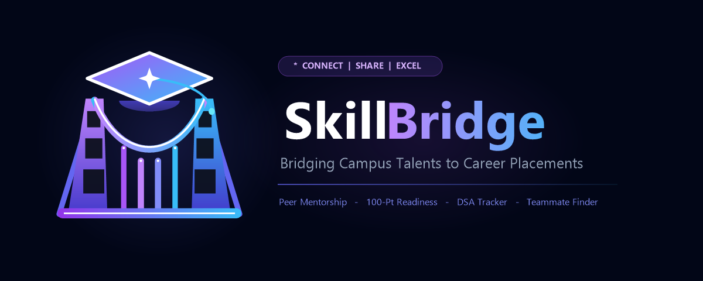
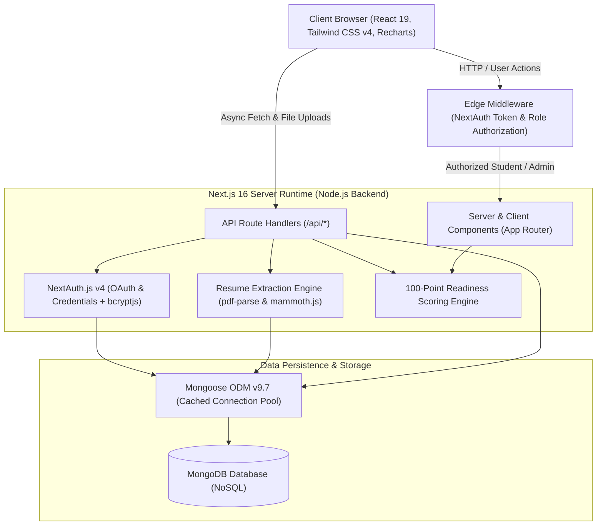

<div align="center">



# SkillBridge 🚀

[](https://nextjs.org/)
[](https://react.dev/)
[](https://nodejs.org/)
[](https://www.mongodb.com/)
[](https://mongoosejs.com/)
[](https://tailwindcss.com/)
[](https://next-auth.js.org/)
[](https://recharts.org/)

</div>

> **SkillBridge** is a modern, full-stack campus career acceleration and placement readiness platform for college students. It bridges academic learning and recruitment benchmarks through placement scoring, competitive programming tracking, automated resume parsing & ATS evaluation, role roadmaps, and peer hackathon matching.
🌐 **Hosted Deployment**: [https://skillbridgehq.vercel.app](https://skillbridgehq.vercel.app) • 📦 **Repository**: [https://github.com/pjha91275/SkillBridge](https://github.com/pjha91275/SkillBridge)

---

## 📑 Table of Contents

- [Overview](#-overview)
- [System Architecture](#-system-architecture)
- [Key Features](#-key-features)
- [Current Implementation vs. Future Scope](#-current-implementation-vs-future-scope)
- [Placement Readiness Scoring](#-placement-readiness-scoring)
- [Technology Stack](#-technology-stack)
- [Project Directory Structure](#-project-directory-structure)
- [API Route Reference](#-api-route-reference)
- [Local Setup & Installation](#-local-setup--installation)
- [Default Admin Credentials & Deployment](#-default-admin-credentials--deployment)
- [Contributing & License](#-contributing--license)

---

## 🌟 Overview

Modern college students often struggle to gauge whether their current skill set aligns with corporate recruitment expectations. **SkillBridge** provides an all-in-one ecosystem that:
- **Quantifies Placement Preparedness**: Computes an objective 100-point **Placement Readiness Score** across academic profiles, projects, DSA progress, certifications, and resume quality.
- **Pinpoints Skill Gaps**: Highlights missing proficiencies against 10 specialized technical roles and corporate hiring partners.
- **Tracks Competitive Programming**: Monitors coding problems across 19 algorithmic topics with multi-platform profile integration.
- **Automates Resume Optimization**: Extracts information from PDF/DOCX resumes, assesses ATS compatibility, and enables side-by-side profile synchronization.
- **Fosters Campus Collaboration**: Connects students for project collaboration and hackathon participation through a peer teammate discovery board.

---

## 🏗️ System Architecture

SkillBridge is built on a modular, multi-tier full-stack architecture powered by the Next.js App Router and a Node.js runtime environment:



### Architectural Highlights
- **Edge Routing & RBAC**: Next.js Edge Middleware inspects encrypted JWT session cookies to enforce role protection (`/dashboard/*` for students, `/admin/*` for admins).
- **In-Memory Buffer Processing**: Document parsing (`pdf-parse` & `mammoth.js`) extracts text from uploaded PDF/DOCX files in server memory without external SaaS APIs.
- **Deterministic Score Engine**: Evaluates acquired competencies, portfolio projects, DSA milestones, and ATS quality into a deterministic 100-point index.
- **Cached Data Persistence**: Mongoose ODM maintains a global cached connection pool across hot reloads, avoiding connection spikes on MongoDB.

---

## ✨ Key Features

### 1. Student Career & Placement Suite
- **Academic Profile Manager**: Manages personal details, CGPA, graduation batch, target roles, social handles (LinkedIn & GitHub), skills, certifications, and portfolio projects.
- **Dynamic Skill Gap Assessment**: Benchmarks competencies against **10 technical roles** (*Frontend, Backend, Full Stack, Software Engineer, Data Analyst, Machine Learning Engineer, DevOps, Cloud Architect, Cybersecurity, Mobile Dev*) with direct documentation links for missing skills.
- **Interactive Career Roadmap**: Step-by-step career path checklist dynamically generated for the student's selected target role.
- **Company Readiness Checker**: Analyzes preparation indices against hiring benchmarks of top corporate recruiters (**Google, Amazon, Microsoft, JPMC, TCS, Infosys**), highlighting matched vs. missing skills.
- **Curated Study Resource Hub**: Filterable library of interview preparation materials across 8 core CS subjects (*DSA, Aptitude, DBMS, OS, Networks, OOP, Web Dev, Interview Prep*) by difficulty and resource type (*PDF, Video, Website, Notes*).
- **Weekly Goal Tracker**: Productivity manager featuring an interactive **Kanban Board** (*Pending*, *In Progress*, *Completed*) and categorized **List View** with priority and deadline controls.

### 2. Competitive Programming & DSA Tracker
- **Multi-Platform Metric Tracking**: Profile tracking for user-logged achievements across **LeetCode, CodeChef, Codeforces, HackerRank, GeeksforGeeks** (ratings, badges, global ranks, stars).
- **19 Algorithmic Topics**: Topic mastery tracking across Arrays, Strings, Searching, Sorting, Recursion, Backtracking, Linked Lists, Stacks, Queues, Hashing, Trees, BST, Heaps, Graphs, Greedy, DP, Tries, Segment Trees, and Bit Manipulation.
- **Problem Log & Revision Queue**: Problem logger with difficulty tiers (*Easy*, *Medium*, *Hard*), platform tags, problem URLs, status, and a **"Revision Needed"** toggle.
- **Streak & Tier Calibration**: Tracks current streaks, record streaks, and target company tier benchmarks (*Tier 1*, *Tier 2*, *Tier 3*).

### 3. Hackathons & Peer Teammate Finder
- **National & Global Hackathons**: Curated directory of premier student competitions (**SIH 2026, Google Hash Code, Microsoft Imagine Cup, Tata Imagination Challenge, Devpost AI**, etc.) with timelines, prize pools, and registration links.
- **Peer Teammate Finder**: Community recruitment board allowing students to publish vacancy listings, specify required technical skill needs (*Frontend*, *Backend*, *AI/ML*, *UI/UX*, *DevOps*), and collaborate.

### 4. Resume Analyzer & Profile Auto-Sync Engine
- **Dual-Mode Submission**: Drag-and-drop file parsing for **PDF & DOCX** files alongside an alternative manual resume builder.
- **Automated Text Extraction**: Server-side parsing of contact details, education records, technical skills, projects, and certifications.
- **ATS Compatibility & Project Scoring**: Evaluates keyword density, formatting compliance, missing sections, project technical strength, and prioritized recommendations (*High*, *Medium*, *Low*).
- **Profile Auto-Sync Review Screen**: Side-by-side comparison modal with granular toggle switches to selectively sync parsed resume data directly into the active SkillBridge profile.

### 5. Visual Telemetry & Admin Controls
- **Recharts Analytics**: Visual telemetry featuring readiness trajectories, DSA competency radar charts, skill gap bar charts, and goal completion rates.
- **Institutional Admin Governance**: Role-protected portal (`/admin`) for student account directories, one-click user deletion, learning resource management, and campus-wide readiness statistics.

---

## 🔮 Current Implementation vs. Future Scope

To maintain transparency, the table below outlines currently live features versus roadmap capabilities planned for future releases:

| Functional Area | Currently Live & Functional in Codebase | Future Scope / Planned Roadmap |
| :--- | :--- | :--- |
| **Competitive Programming** | Manual platform stats logging, 19-topic tracker, problem CRUD with revision flags & streaks | Direct OAuth live scraping / automated webhooks with LeetCode & Codeforces APIs |
| **Hackathon Directory** | Curated competition dataset (SIH, Hash Code, etc.) with registration bookmarking & teammate board | Automated real-time scrapers for dynamic event feeds (Devpost/Unstop) & in-app direct chat |
| **Company Readiness** | Algorithmic readiness matching against 6 top recruiters (Google, Amazon, Microsoft, JPMC, TCS, Infosys) | Expanded criteria database for 50+ enterprise tech firms and custom company profile creation |
| **Analytics Telemetry** | Dynamic DSA radar charts, skill gap comparisons, and real-time goal completion rates | Longitudinal multi-month historical DB snapshots (current 6-week trend is dynamically projected) |
| **Account Settings** | Security overview, interface configuration, and credentials status display | Self-service password reset workflows and live email notification dispatchers |

---

## 📊 Placement Readiness Scoring

$$\text{Readiness Score (100 pts)} = \text{Skills (25)} + \text{Projects (25)} + \text{DSA (20)} + \text{Certs (10)} + \text{Resume ATS (20)}$$

| Category | Max Pts | Evaluation Basis |
| :--- | :---: | :--- |
| **Role Skills** | 25 | Matched target role skills: $(\text{Acquired} / \text{Required}) \times 25$, or $\min(25, \text{Count} \times 4)$ |
| **Projects** | 25 | Practical verified portfolio projects: $\min(25, \text{Project Count} \times 12.5)$ |
| **DSA Progress** | 20 | Topic mastery & problem solving percentage: $\text{DSA Progress (\%)} \times 0.20$ |
| **Certifications**| 10 | Completed industry certifications: $\min(10, \text{Cert Count} \times 5)$ |
| **Resume ATS** | 20 | Heuristic ATS analysis score from uploaded resume: $(\text{ATS Score} / 100) \times 20$ |

- **Tier 1 Target (80–100 pts)**: Strong placement profile meeting top-tier product company hiring bars.
- **Tier 2 Target (60–79 pts)**: Competitive intermediate candidate with solid fundamental coursework and projects.
- **Tier 3 Target (<60 pts)**: Foundation building phase focusing on closing initial core skill and project gaps.

---

## 🛠️ Technology Stack

- **Backend & Server Runtime**: **[Node.js](https://nodejs.org/) (v18+)** powering Next.js server runtime, modular API Route Handlers, buffer file parsing, and Edge middleware (serving as the backend layer in place of standalone Express.js).
- **Full-Stack Framework**: **[Next.js 16 (App Router)](https://nextjs.org/)** utilizing React Server Components (RSC), modular Route Handlers, Server Actions, and Edge Middleware.
- **Frontend UI & Compiler**: **[React 19](https://react.dev/)** & **React DOM 19** with **Babel Plugin React Compiler** for automatic fine-grained component memoization.
- **Database & Object Data Modeling**: **[MongoDB](https://www.mongodb.com/)** with **[Mongoose ODM v9.7](https://mongoosejs.com/)** (schema models for Users, Profiles, DSA Trackers, Goals, Resources, Resumes, and Teammate Posts, cached connection pooling, and automated database seeding).
- **Authentication & Security**: **[NextAuth.js v4.24](https://next-auth.js.org/)** (Credentials provider, Google & GitHub OAuth 2.0, JWT session strategy, Edge middleware protection) & **[bcryptjs](https://github.com/dcodeIO/bcrypt.js)** for password hashing.
- **Data Visualization & Charts**: **[Recharts v3.8](https://recharts.org/)** (Line charts for progress trends, multi-axis Radar charts for DSA competence, Bar charts for skill gap comparisons, and Pie charts for problem difficulty distribution).
- **Document & Resume Processing**: **[pdf-parse](https://www.npmjs.com/package/pdf-parse)** (binary buffer PDF text extraction) & **[Mammoth.js](https://github.com/mwilliamson/mammoth.js)** (Word .docx text and structural extraction).
- **Styling & Design System**: **[Tailwind CSS v4](https://tailwindcss.com/)** (`@theme` tokens, glassmorphic panels, glowing skeleton loaders, custom animations), **[Lucide React](https://lucide.dev/)** icons, **clsx** & **tailwind-merge**.
- **Code Quality**: **ESLint 9** & **eslint-config-next**.

---

## 📁 Project Directory Structure

```text
SkillBridge/
├── public/                          # Static assets and icons
├── src/
│   ├── middleware.js                # Edge auth & role-based route guard
│   ├── app/                         # Next.js 16 App Router
│   │   ├── globals.css              # Tailwind v4 theme, animations & glassmorphism
│   │   ├── layout.jsx / page.jsx    # Root layout and landing page
│   │   ├── (admin-dashboard)/admin/ # Admin overview, user directory & resources
│   │   ├── admin/login/             # Dedicated admin login gateway
│   │   ├── login/ & register/       # Student authentication pages
│   │   ├── dashboard/               # Student features (analytics, dsa-tracker,
│   │   │                            # hackathons, resume-analyzer, roadmap, goals,
│   │   │                            # company-readiness, skill-gap, resources, profile)
│   │   └── api/                     # Node.js API Route Handlers
│   │       ├── admin/users/         # User directory & deletion
│   │       ├── auth/                # NextAuth & registration endpoints
│   │       ├── dsa-tracker/         # DSA stats & problem CRUD
│   │       ├── hackathons/teammates/# Teammate post recruitment API
│   │       ├── resume-analyzer/     # PDF/DOCX parsing & Profile Auto-Sync
│   │       ├── profile/             # Profile management
│   │       ├── goals/               # Kanban/List goal CRUD
│   │       └── resources/           # Study resources query & moderation
│   ├── components/                  # Navbar, SessionProvider & UI components
│   ├── lib/                         # db.js (Mongoose connection & seeder), utils.js
│   └── models/                      # User, Profile, DsaTracker, Goal, Resource,
│                                    # ResumeAnalysis, ResumeChecklist, TeammatePost
├── .env.example                     # Environment template
└── package.json                     # Dependencies & scripts
```

---

## 🔌 API Route Reference

| Area | Method & Route | Description | Auth / Access |
| :--- | :--- | :--- | :--- |
| **Auth** | `POST /api/auth/register` | Register new student account | Public |
| **Auth** | `GET/POST /api/auth/[...nextauth]` | NextAuth session & OAuth handlers | Public |
| **Profile** | `GET, POST /api/profile` | Read and update student profile | Authenticated |
| **DSA** | `GET, POST /api/dsa-tracker` | Retrieve & update DSA platforms/streaks | Authenticated |
| **DSA** | `POST, DELETE /api/dsa-tracker/problems` | Add or delete solved problems | Authenticated |
| **Hackathons**| `GET, POST, DELETE /api/hackathons/teammates` | Teammate recruitment board CRUD | Authenticated |
| **Resume** | `GET, POST /api/resume-analyzer` | Upload & parse PDF/DOCX or manual resume | Authenticated |
| **Resume** | `POST /api/resume-analyzer/sync` | Sync parsed resume data into profile | Authenticated |
| **Goals** | `GET, POST, DELETE /api/goals` | Manage weekly Kanban/List goals | Authenticated |
| **Resources**| `GET, POST, DELETE /api/resources` | Query (Students) or moderate (Admin) | Authenticated |
| **Admin** | `GET /api/admin/users`, `DELETE /api/admin/users/[id]` | User directory and account deletion | Admin Only |

---

## 💻 Local Setup & Installation

### Prerequisites
- **Node.js**: v18.17.0 or higher (Node 20+ recommended)
- **MongoDB**: Local instance running on port `27017` or a MongoDB Atlas URI

### 1. Clone & Install
```bash
git clone https://github.com/pjha91275/SkillBridge.git
cd SkillBridge
npm install
```

### 2. Configure Environment Variables
Create a `.env.local` file in the root directory:
```bash
cp .env.example .env.local   # Linux/macOS
# or: Copy-Item .env.example .env.local (Windows PowerShell)
```

Populate the required values:
```env
MONGODB_URI=mongodb://localhost:27017/skillbridge
NEXTAUTH_URL=http://localhost:3000
NEXTAUTH_SECRET=your_generated_secret_key

# Optional OAuth
GOOGLE_CLIENT_ID=your_google_client_id
GOOGLE_CLIENT_SECRET=your_google_client_secret
GITHUB_CLIENT_ID=your_github_client_id
GITHUB_CLIENT_SECRET=your_github_client_secret
```

### 3. Run Development Server
```bash
npm run dev
```
Open **[http://localhost:3000](http://localhost:3000)** in your browser.

### 4. Build for Production
```bash
npm run build
npm run start
```

---

## 🔑 Default Admin Credentials & Deployment

SkillBridge automatically seeds an institutional admin on initial database connection:
- **Admin Portal**: [http://localhost:3000/admin/login](http://localhost:3000/admin/login)
- **Email**: `admin@skillbridge.edu`
- **Password**: `adminpassword123`

### Cloud Deployment (Vercel & MongoDB Atlas)
1. Deploy a database cluster on **MongoDB Atlas**, whitelist IP access, and copy your connection string into `MONGODB_URI`.
2. Configure all environment variables from `.env.local` inside the hosting provider dashboard (e.g. Vercel, Render).
3. Ensure `NEXTAUTH_URL` matches the live production URL (e.g., `https://skillbridge.example.com`).
4. Generate a 32-byte cryptographically secure production secret for `NEXTAUTH_SECRET`.

---

## 🤝 Contributing & License
1. Fork the repository & create your branch (`git checkout -b feature/NewFeature`)
2. Commit your changes (`git commit -m 'Add NewFeature'`)
3. Push to branch (`git push origin feature/NewFeature`) and open a Pull Request.

Distributed under the MIT License. Contributions and feedback are welcome!
---
<p align="center">
  <b>SkillBridge</b> — Built with ❤️ for college students aiming for dream technical careers.
</p>
